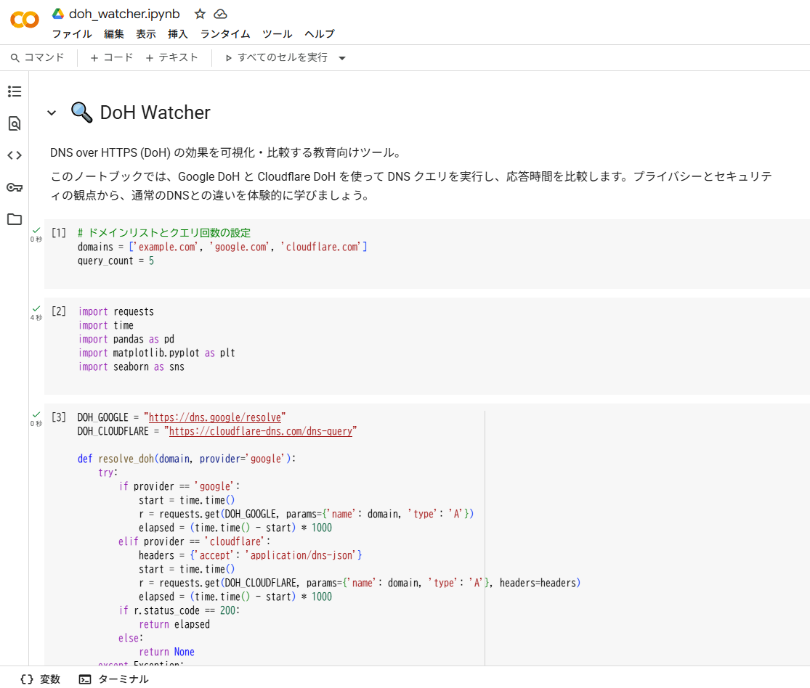
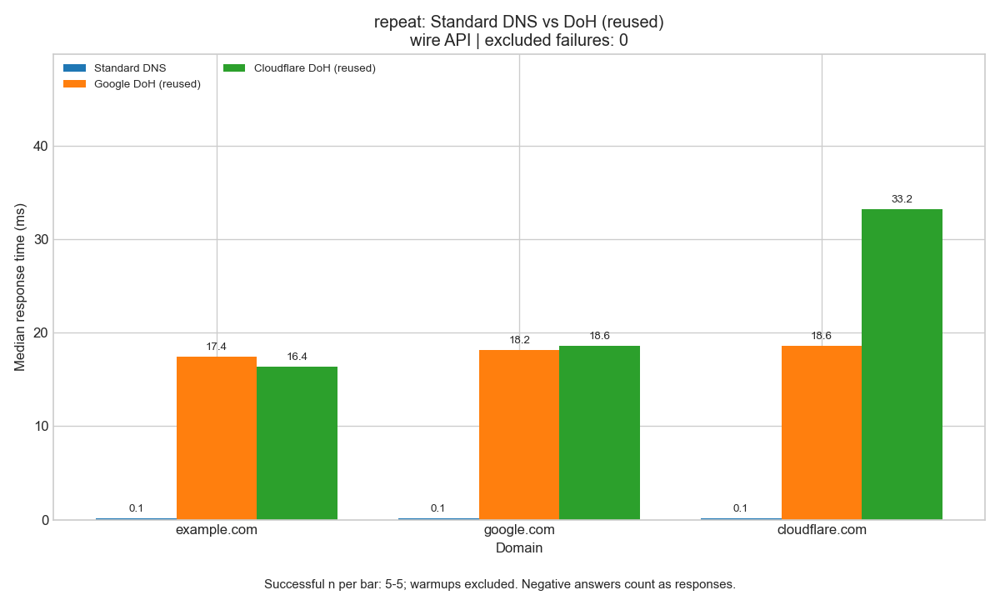
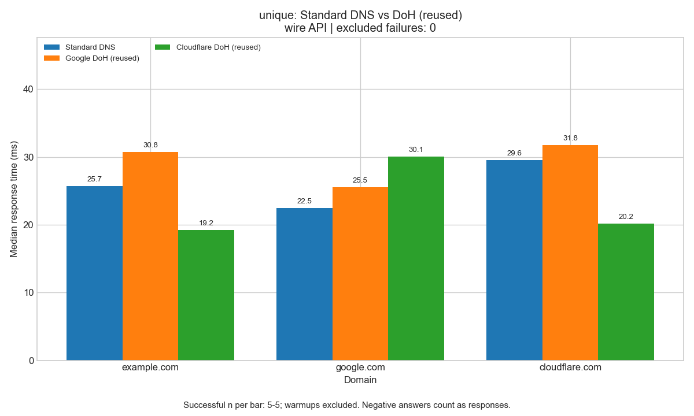
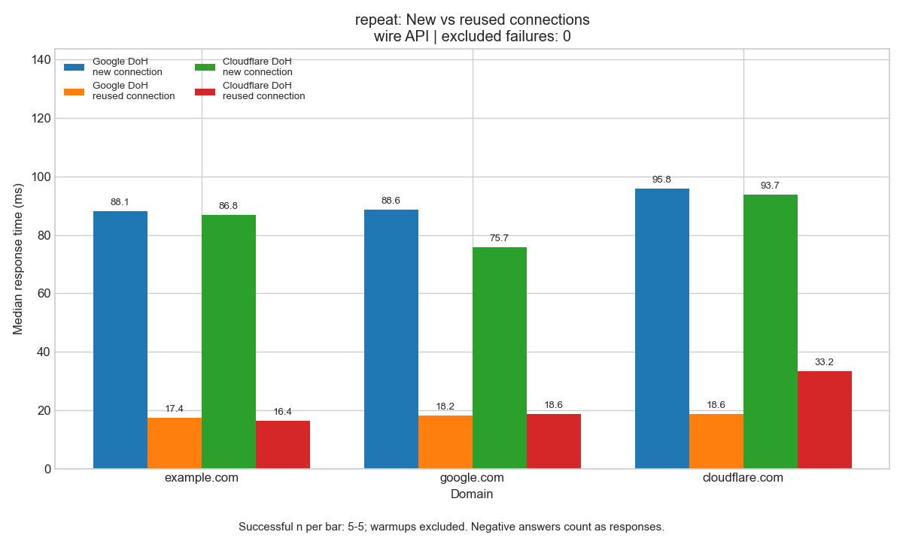

# DoH Watcher

English · [日本語](README.md)


[](https://colab.research.google.com/github/ipusiron/doh-watcher/blob/main/doh_watcher.ipynb)

**Day015 - 100 Security Tools with Generative AI**

**DoH Watcher** is a teaching notebook for seeing what DNS over HTTPS actually costs and actually hides. It runs in Google Colab and compares plain DNS with DoH, keeping repeated names apart from unique ones, and new connections apart from reused ones. It queries both the JSON API and the RFC 8484 wireformat, and shows the DNSSEC AD flag.

This is a Jupyter notebook, not a web page, so there is no UI to switch languages. The notebook and its explanations are in Japanese; this file describes what it does in English.

---

## 🌐 Run it

👉 [Open in Colab](https://colab.research.google.com/github/ipusiron/doh-watcher/blob/main/doh_watcher.ipynb)

---

## 📸 Screenshots

The graphs below were measured locally on 2026-09-20. Each condition had 5 successes and 0 failures, with one warm-up excluded. **The numbers and the ranking change with the environment.**


> *What the notebook looks like in Colab (an earlier revision).*


> *With repeated names, plain DNS answered quickly — most likely from a cache hit. DoH here is wireformat over a reused connection.*


> *With unique names, the cache for the same name is avoided and the gap narrows. Negative answers are counted too.*


> *repeat, wireformat: the cost of establishing a connection, shown directly.*

**The measurement conditions decide the answer.** One reason plain DNS looks fast is the OS resolver cache. Avoid that cache and the gap narrows; in some environments DoH comes out ahead. For DoH, the TLS/TCP handshake is a large part of the delay, and reusing the connection removes most of it — though server load and network path also move the numbers.

**Which provider is "faster" swaps around depending on where, when and through what you measure. Do not decide a lasting ranking from one run.**

---

## ✨ What it does

| | |
|---|---|
| DoH queries | Google and Cloudflare, via their JSON APIs and via RFC 8484 wireformat |
| Timing | mean, median, p95, min, max, sample standard deviation, successes (n), failures |
| Graphs | bars at the median, with failures and excluded warm-ups stated |
| Comparison with plain DNS | repeat vs unique; for DoH, new connection vs reused |
| DNSSEC | the AD flag with and without the DO bit |
| Explanations | DNS and network basics, the limits of the measurement, and where the queries go |

---

## 📖 How to use it

1. Open it in Colab, or download `doh_watcher.ipynb` and open that.
2. Check the settings cell: `domains`, `query_count = 5`, `timeout = 5`, `warmup = 1`. **Do not raise the count against domains you do not own.**
3. Pick `mode` — `'json'`, `'wire'` or `'both'` — and run the cells from the top.
4. Read the per-scenario table and the median bar chart. The last cell compares the DNSSEC AD flag.

Failures are shown by exception type with a safe description, and are left out of the timing statistics. Warm-up failures stay in the list. On HTTP 401 the notebook stops rather than retrying. Nothing asks for credentials.

---

## 🔬 What the measurement can and cannot say

| Condition | What it means, and its limits |
|---|---|
| repeat | The same name, over and over. Affected by caches in the OS and in recursive resolvers |
| unique | A fresh 16-hex-digit label each time. NXDOMAIN and NODATA count as valid answers |
| new connection | A new `requests.Session` each time, discarded afterwards |
| reused connection | One Session per provider, kept open |

`requests` has no HTTP response cache of its own, but **DoH providers have DNS caches too**. Even `unique` cannot clear delegation data, negative answers or DNSSEC negative proofs, so it is not a cold cache. Names with a wildcard record may answer positively.

Each condition gets a warm-up, and the order of conditions is randomised. `time.perf_counter()` measures through reading and parsing the answer; for new connections it includes creating and closing the Session. The OS API cannot tell NXDOMAIN from NODATA, so both are treated as negative answers.

p95 is linear interpolation at position `(n - 1) × 0.95` in the sorted values. The standard deviation is the sample one. With one success it is 0; with none, the timing statistics are `None` and the bar reads "no data". **At five measurements, p95 and the mean are easily moved by a single outlier.**

### JSON API and wireformat

The JSON API is **not** RFC 8484 — it is Google's and Cloudflare's own. Wireformat receives the binary DNS message as `application/dns-message`, with the GET `dns` parameter in unpadded base64url.

| Provider | JSON API | Wireformat |
|---|---|---|
| Google | `https://dns.google/resolve` | `https://dns.google/dns-query` |
| Cloudflare | `https://cloudflare-dns.com/dns-query` | `https://cloudflare-dns.com/dns-query` |

Name compression and A / AAAA / CNAME parsing are handled. With DO set, an OPT RR with a UDP payload size of 1232 is added.

Quad9 (`dns.quad9.net`) requires HTTP/2, so `requests` (HTTP/1.1) gets a 505 back. It cannot be used from this notebook.

### DoH and DNSSEC

DoH encrypts the path between you and the provider. DNSSEC authenticates the data with signatures. **The notebook does not verify signatures itself** — it shows the AD flag the resolver returns.

On 2026-09-20, both providers returned AD=True for `example.com` with DO and AD=False without it; `google.com` was AD=False either way. Signing state and resolver policy change, so do not treat this as a fixed answer.

---

## 🛡️ What DoH protects

| | Plain DNS | DoH |
|---|---|---|
| The name being queried | visible | hidden by TLS |
| Which DNS server you use | visible | the HTTPS destination IP is still visible |
| Resistance to tampering | none | detectable through TLS |

**The provider still sees who asked for what.** Hiding the query from third parties on the path is not the same as hiding it from the provider — that takes trust. Oblivious DoH ([RFC 9230](https://www.rfc-editor.org/rfc/rfc9230.html)) separates the asker from the query to address this. It is not implemented here.

---

## 🎯 Use cases

### Ways of using this tool in particular

- Confirming that a DNS name is encoded into the wire format (encoding and protocol classes): encoding `example.com` gives a run of length-prefixed labels, `07 'example' 03 'com' 00` (076578616d706c6503636f6d00 in hex). You can confirm, as bytes, that a domain name is sent to DNS not as a dot-separated string but as a run with each label's length in front
- Confirming that the query is carried in a URL as base64url over HTTPS (DoH and privacy classes): turning the built DNS query into base64url (no padding) gives a string starting `AAABAAAB...`, which can be turned back into the query. DoH puts this in an HTTPS GET parameter, so an on-path observer sees only the HTTPS connection, not the queried name
- Confirming that response times are compared by percentile (statistics classes): for the response times `[10, 20, 30, 40, 50]`, the 50th percentile (median) is 30 and the 95th is 48. You can confirm comparing DoH and standard DNS response times by percentile, which looks at a position in the distribution rather than the mean

### General uses

- Measure and compare the response times and behavior of DoH and standard DNS in your own environment
- Use it as material to learn the DNS wire format and base64url encoding
- Use it as material to explain network privacy (protection from on-path observation)

## 🔒 Security and privacy

Queries go to `dns.google` and `cloudflare-dns.com` over HTTPS, and to your OS resolver for comparison. What is sent is the domain names in the settings cell, plus the random subdomains generated for `unique`. Resolving the DoH servers themselves depends on your OS.

Nothing collects personal data, browsing history or credentials. **Do not put personal or internal names into the domain list.**

Certificate verification stays on. The Session is built without automatic redirects or retries, and ignores proxy environment variables and `.netrc`. Raw exception strings are not shown — only the type and a safe description. On HTTP 401 it stops.

---

## ⚠️ Cautions

- `unique` queries can reach public authoritative servers. **Do not run them in volume against domains someone else operates.**
- Caches live in several places. Treating `repeat` as "cached" and `unique` as "uncached" is a rough guide, not a controlled experiment.
- The HTTPS `timeout` covers connect and read; it is not a hard bound on the whole measurement. OS name resolution time depends on OS settings.
- Where a proxy is mandatory, this may not work at all. **Do not disable certificate verification to get around a restriction.**
- Five runs is a teaching-sized sample. Do not generalise the timings or the provider ranking.

---

## 📦 Libraries

`requests` for the queries, `pandas` for the tables, `matplotlib` for the bar chart — all preinstalled in Colab. From the standard library: `time` for timing, `base64` and `struct` for wireformat, `statistics` for the numbers. Nothing is installed at run time. The style name `seaborn-v0_8-whitegrid` ships with matplotlib; the package of that name is not needed.

---

## 🧪 Tests

```console
python -m unittest discover -s tests -v
```

Python 3.11 or 3.12, standard library only. No installs, no network.

`tests/nbloader.py` reads the notebook as JSON and loads only the code cells tagged `core`. The tests cover the known answers from the RFC, compressed names, the DO bit, the statistics, warm-ups, failure counts, Session reuse, and the claims in the README. GitHub Actions runs the same tests on every push and pull request.

---

## 🔗 References

- [RFC 8484](https://www.rfc-editor.org/rfc/rfc8484.html) — DNS Queries over HTTPS
- [RFC 9230](https://www.rfc-editor.org/rfc/rfc9230.html) — Oblivious DNS over HTTPS
- [Google Public DNS JSON API](https://developers.google.com/speed/public-dns/docs/doh/json)
- [Cloudflare JSON API](https://developers.cloudflare.com/1.1.1.1/encryption/dns-over-https/make-api-requests/dns-json/)
- [Cloudflare: DNS encryption explained](https://blog.cloudflare.com/dns-encryption-explained/)

---

## 📄 License

MIT License — see [LICENSE](LICENSE).

---

## 🛠️ About this project

This tool is part of **100 Security Tools with Generative AI**, in which one security-related tool is built and published each day with the help of generative AI.

🔗 [https://akademeia.info/?page_id=42163](https://akademeia.info/?page_id=42163)
