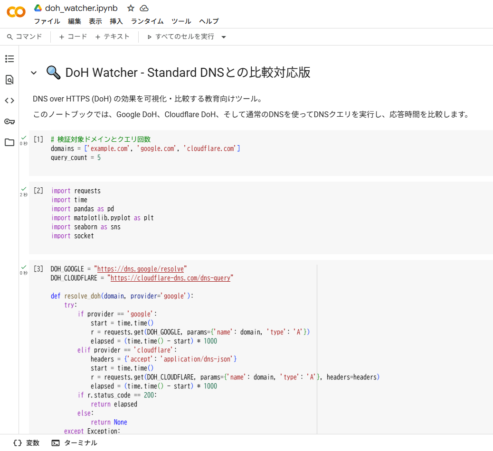

# DoH Watcher - DNS over HTTPS効果観察ツール

**Day15 - 生成AIで作るセキュリティツール100**

**DoH Watcher**は、DNS over HTTPS（DoH）の実際の効果を体験的に学べる教育向けツールです。  
Google Colab上で動作し、以下の機能を通じて「通常のDNS」と「DoH」の違いを実測・視覚化できます。

- 各方式のDNS応答時間の比較
- Google DoH / Cloudflare DoH に対応
- 棒グラフ・表・Markdown解説による可視化
- プライバシー保護やセキュリティへの影響を実感

---

## 🚀 デモ（Colabで今すぐ実行）

👉 [Colabで開く](https://colab.research.google.com/github/ipusiron/doh-watcher/blob/main/doh_watcher.ipynb)

---

## 📸 実行例のスクリーンショット

以下は実際の画面例です。

>
>
> *Colabで実行しているところ*

>
>
> *DoHより通常のDNSのほうが圧倒的にレスポンスが早い。*
> *Claudeflare DoHのほうがGoogle DoHよりレスポンスが早い。*

---

## 🛠️ 機能一覧

| 機能                         | 説明                                                                 |
|------------------------------|----------------------------------------------------------------------|
| DoHによるDNS応答取得         | Google/CloudflareのDoH APIを用いてDNSクエリーを実行します。         |
| 応答時間の測定               | クエリー1回ごとにミリ秒単位で応答時間を記録し、平均を算出します。       |
| グラフによる可視化           | 各ドメインに対する応答時間を棒グラフで表示します。                   |
| 通常DNSとの比較              | 同一ドメインに対する通常DNSとDoHの応答速度を比較します。|
| Markdown解説付き             | 初心者でも学べるよう、ネットワークとDNSの基礎を補足解説しています。   |

---

## ▶️ `doh_watcher.ipynb`ファイルの使い方

1. 上記の「Colabで開く」リンクをクリックしてノートブックを開きます。あるいは、GitHubから`doh_watcher.ipynb`ファイルをダウンロードしてから、Colabを起動しノートブックとして開きます。
2. 上から順にセルを実行してください。[Shift]＋[Enter]キーまたは「ランタイム」→「すべてのセルを実行」を選びます。
3. 各ドメインに対してGoogle DoH/Cloudflare DoHでDNSクエリーが送信され、応答時間が計測されます。
4. 最後に、結果が棒グラフで可視化され、比較が一目でわかります。

> 🔸 通信に失敗する場合、数秒おいて再実行してください（Colabの外部通信制限の影響）。

---

## 📚 教育目的での使い方

### 🧠 このツールで学べること

| テーマ             | 内容                                                                 |
|--------------------|----------------------------------------------------------------------|
| DNSの仕組み         | IPアドレスを得るための名前解決プロセスを学びます。                    |
| 暗号化通信          | HTTPSによりDNSクエリー内容が秘匿される利点を実感できます。               |
| プライバシーの保護  | DoHがユーザーの通信を守る一方で、監視が難しくなる点も理解できます。     |
| 遅延とトレードオフ  | DoH導入による応答遅延とプライバシー向上のバランスを考察できます。       |

---

### 🎓 ステップアップの方向性

| レベル | 学習課題                                                                 |
|--------|--------------------------------------------------------------------------|
| 初級   | DNSとは何か？　名前解決とは？　HTTPとHTTPSの違いとは？                      |
| 中級   | DoHのAPIの仕様や、TLSハンドシェイクの流れを理解する                      |
| 上級   | DNSSECやDoT（DNS over TLS）との違いを検証・トラフィック分析や可視化へ拡張 |

---

## 📦 使用ライブラリ

- `requests`：DoHクエリー送信用
- `time`：応答時間計測
- `pandas`：データ集計と表作成
- `matplotlib`, `seaborn`：可視化

すべて Google Colab にプリインストールされています。

---

## 📄 ライセンス

MIT License - [LICENSE](LICENSE)ファイルを参照

---

## 🛠 このツールについて

本ツールは、「生成AIで作るセキュリティツール100」プロジェクトの一環として開発されました。 このプロジェクトでは、AIの支援を活用しながら、セキュリティに関連するさまざまなツールを100日間にわたり制作・公開していく取り組みを行っています。

プロジェクトの詳細や他のツールについては、以下のページをご覧ください。

🔗 [https://akademeia.info/?page_id=42163](https://akademeia.info/?page_id=42163)

