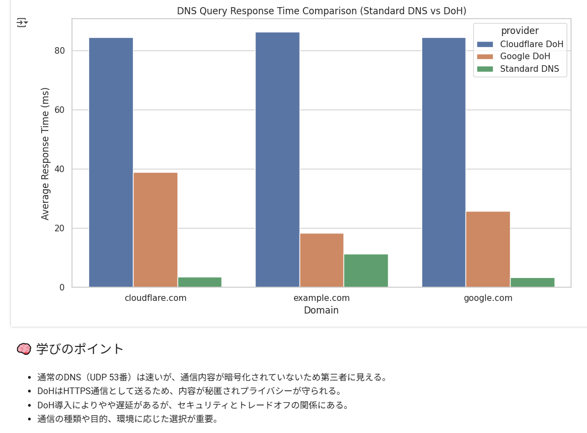

<!--
---
id: day015
slug: doh-watcher

title: "DoH Watcher"

subtitle_ja: "DNS over HTTPS効果観察ツール"
subtitle_en: "DNS over HTTPS Effect Observation Tool"

description_ja: "通常のDNSとDoH（Google/Cloudflare）の応答時間を比較・可視化し、DoHの効果を体験的に学べる教育ツール"
description_en: "An educational tool to compare and visualize response times between traditional DNS and DoH (Google/Cloudflare), enabling hands-on learning of DoH benefits"

category_ja:
  - ネットワーク
category_en:
  - Network

difficulty: 2

tags:
  - DNS
  - DoH
  - HTTPS
  - Google Colab
  - Privacy

repo_url: "https://github.com/ipusiron/doh-watcher"
demo_url: "https://colab.research.google.com/github/ipusiron/doh-watcher/blob/main/doh_watcher.ipynb"

hub: true
---
-->

# DoH Watcher - DNS over HTTPS効果観察ツール

**Day15 - 生成AIで作るセキュリティツール100**

**DoH Watcher**は、DNS over HTTPS（DoH）の実際の効果を体験的に学べる教育向けツールです。  
Google Colab上で動作し、以下の機能を通じて「通常のDNS」と「DoH」の違いを実測・視覚化できます。

- 各方式のDNS応答時間の比較
- Google DoH / Cloudflare DoH に対応
- 棒グラフ・表・Markdown解説による可視化
- プライバシー保護やセキュリティへの影響を実感

---

## 🚀 デモ（Colabで今すぐ実行）

👉 [Colabで開く](https://colab.research.google.com/github/ipusiron/doh-watcher/blob/main/doh_watcher.ipynb)

---

## 📸 実行例のスクリーンショット

以下は実際の画面例です。

>
>
> *Colabで実行しているところ*

>
>
> *通常DNSはDoHより圧倒的にレスポンスが早い。*
> *Google DoHはClaudeflare DoHよりレスポンスが早い。*

---

## 🛠️ 機能一覧

| 機能                         | 説明                                                                 |
|------------------------------|----------------------------------------------------------------------|
| DoHによるDNS応答取得         | Google/CloudflareのDoH APIを用いてDNSクエリーを実行します。         |
| 応答時間の測定               | クエリー1回ごとにミリ秒単位で応答時間を記録し、平均を算出します。       |
| グラフによる可視化           | 各ドメインに対する応答時間を棒グラフで表示します。                   |
| 通常DNSとの比較              | 同一ドメインに対する通常DNSとDoHの応答速度を比較します。|
| Markdown解説付き             | 初心者でも学べるよう、ネットワークとDNSの基礎を補足解説しています。   |

---

## ▶️ `doh_watcher.ipynb`ファイルの使い方

1. 上記の「Colabで開く」リンクをクリックしてノートブックを開きます。あるいは、GitHubから`doh_watcher.ipynb`ファイルをダウンロードしてから、Colabを起動しノートブックとして開きます。
2. 上から順にセルを実行してください。[Shift]＋[Enter]キーまたは「ランタイム」→「すべてのセルを実行」を選びます。
3. 各ドメインに対してGoogle DoH/Cloudflare DoHでDNSクエリーが送信され、応答時間が計測されます。
4. 最後に、結果が棒グラフで可視化され、比較が一目でわかります。

> 🔸 通信に失敗する場合、数秒おいて再実行してください（Colabの外部通信制限の影響）。

---

## 🔐 DoHの暗号化の仕組みとは？

### ✅ 通常のDNS（暗号化なし）

- 通常のDNSは **UDPポート53** を使い、ドメイン名とそれに対応するIPアドレスの問い合わせを**平文で通信**します。
- このため、ネットワーク上を通るDNSクエリーは、プロバイダ・Wi-Fi管理者・攻撃者から**簡単に盗聴・改ざん**が可能です。

---

### ✅ DoH（DNS over HTTPS）のしくみ

DoHでは、**DNSクエリーそのものをHTTPS通信の中に埋め込み、Web通信と同じ経路で暗号化して送信**します。

#### 🔄 処理の流れ：

1. **クライアント（例：ブラウザ）**がドメイン名の解決を要求。
2. 通常のDNSではなく、**HTTPS POST/GETリクエスト**としてDoHサーバに送信。
3. クエリーはHTTPSの内部（TLSトンネル）にあるため、**中身は第三者には読めない**。
4. DoHサーバがDNSの応答を返し、それもHTTPS経由で暗号化されたまま届く。

---

### 🛡️ 守られるもの

| 守られる情報           | 通常DNSでは？     | DoHでは？                  |
|------------------------|------------------|----------------------------|
| クエリー内容（ドメイン名） | 見える            | 見えない（TLSで暗号化）     |
| 送信先DNSサーバ         | 見える            | HTTPS先としてしか見えない  |
| 改ざん耐性              | なし             | TLSにより検知・排除可能     |

---

### 📦 技術的には何を使っているの？

- **TLS（Transport Layer Security）**：HTTPSと同じ暗号化層を使用
- **HTTPSのリクエスト形式**：DNSクエリーをURLパラメータまたはバイナリPOSTとして送信
- **DoHサーバのエンドポイント例**：`https://dns.google/resolve`など

---

### 🧠 教育的に注目したいポイント

- **「暗号化すること」が何を守るのか？**  
  コンテンツだけでなく、**どのサイトを見ようとしているか**という行動情報も保護される。

- **HTTPSの再利用による効率**  
  既存のWeb経路に載せることで、**ファイアウォールの検閲や監視を回避しやすい**。一方で企業・学校にとっては管理が困難になる。

---

DoHは、HTTPSという既存のインフラを活かしてDNSの脆弱性を解決しようとする、現代インターネット設計の好例です。

### 📚 DoH学習参考サイト（日本語）

- 🔸 **さくらのナレッジ：「DNS over HTTPSを理解する」**  
　図解が豊富で、DoHの基本や通常DNSとの違いを丁寧に解説。初心者に最適。  
　👉 [https://ssl.sakura.ad.jp/column/doh/](https://ssl.sakura.ad.jp/column/doh/)

- 🔸 **Cloudflare公式ブログ（日本語）**  
　DoHの目的、プライバシー保護の意義、実装背景などをわかりやすく紹介。  
　👉 [https://blog.cloudflare.com/ja-jp/dns-encryption-explained/](https://blog.cloudflare.com/ja-jp/dns-encryption-explained/)

- 🔸 **RFC 8484 日本語訳（DNS over HTTPS仕様）**  
　DoHの公式仕様文書（RFC 8484）の日本語訳。構造・プロトコルを深く理解したい人向け。  
　👉 [https://tex2e.github.io/rfc-translater/html/rfc8484.html](https://tex2e.github.io/rfc-translater/html/rfc8484.html)

---

## 📚 教育目的での使い方

### 🧠 このツールで学べること

| テーマ             | 内容                                                                 |
|--------------------|----------------------------------------------------------------------|
| DNSの仕組み         | IPアドレスを得るための名前解決プロセスを学びます。                    |
| 暗号化通信          | HTTPSによりDNSクエリー内容が秘匿される利点を実感できます。               |
| プライバシーの保護  | DoHがユーザーの通信を守る一方で、監視が難しくなる点も理解できます。     |
| 遅延とトレードオフ  | DoH導入による応答遅延とプライバシー向上のバランスを考察できます。       |

---

### 🎓 ステップアップの方向性

| レベル | 学習課題                                                                 |
|--------|--------------------------------------------------------------------------|
| 初級   | DNSとは何か？　名前解決とは？　HTTPとHTTPSの違いとは？                      |
| 中級   | DoHのAPIの仕様や、TLSハンドシェイクの流れを理解する                      |
| 上級   | DNSSECやDoT（DNS over TLS）との違いを検証・トラフィック分析や可視化へ拡張 |

#### 🔰 初級：DNSとHTTPSの基礎理解から始めよう（〜高校情報IIレベル）
まずはDNSの役割と仕組み（名前解決とは何か）を理解しましょう。
ドメイン名がどのようにIPアドレスへ変換されるか、dig や nslookup を使って確認すると実感が湧きます。

次にHTTPとHTTPSの違いを学び、「通信が暗号化されるとはどういうことか」「なぜそれが重要なのか」を体験的に理解することが目標です。
DoH Watcherの実行と結果観察を通じて、「通常DNSは暗号化されていない」ことに気づければ大成功です。

#### 🧭 中級：DoHとTLSの動作原理を掘り下げる（高専・大学前半向け）
DoHがどのようなAPIを使って通信しているのか、クエリーとレスポンスの形式（例：JSON構造）を実際に観察しましょう。

次に、HTTPSが使用するTLSのハンドシェイク手順（証明書交換、鍵生成など）を図解やツール（openssl, Wireshark）を用いて確認することが学習の中心です。

また、通常DNSとDoHのトラフィックの違い（ポート番号、可視性）を可視化することで、「暗号化されることで何が守られるか」を深く理解できます。

#### 🧠 上級：関連技術との比較とセキュリティ観点での分析（大学・専門職向け）
DNSのセキュリティ強化技術であるDNSSECや、DoHの兄弟的存在であるDoT（DNS over TLS）と比較し、それぞれの長所短所を整理しましょう。

次に、Wireshark等を使ったパケットキャプチャーや、疑似トラフィックを使った可視化ツールの開発など、より高度なネットワーク分析に挑戦します。
加えて、企業ネットワークにおけるDoHのメリット・リスク（例：管理者が見えなくなる問題）についても多面的に考察できると、実践的な理解が身につきます。

---

## 📦 使用ライブラリ

- `requests`：DoHクエリー送信用
- `time`：応答時間計測
- `pandas`：データ集計と表作成
- `matplotlib`, `seaborn`：可視化

すべて Google Colab にプリインストールされています。

---

## 📄 ライセンス

MIT License - [LICENSE](LICENSE)ファイルを参照

---

## 🛠 このツールについて

本ツールは、「生成AIで作るセキュリティツール100」プロジェクトの一環として開発されました。 このプロジェクトでは、AIの支援を活用しながら、セキュリティに関連するさまざまなツールを100日間にわたり制作・公開していく取り組みを行っています。

プロジェクトの詳細や他のツールについては、以下のページをご覧ください。

🔗 [https://akademeia.info/?page_id=42163](https://akademeia.info/?page_id=42163)

